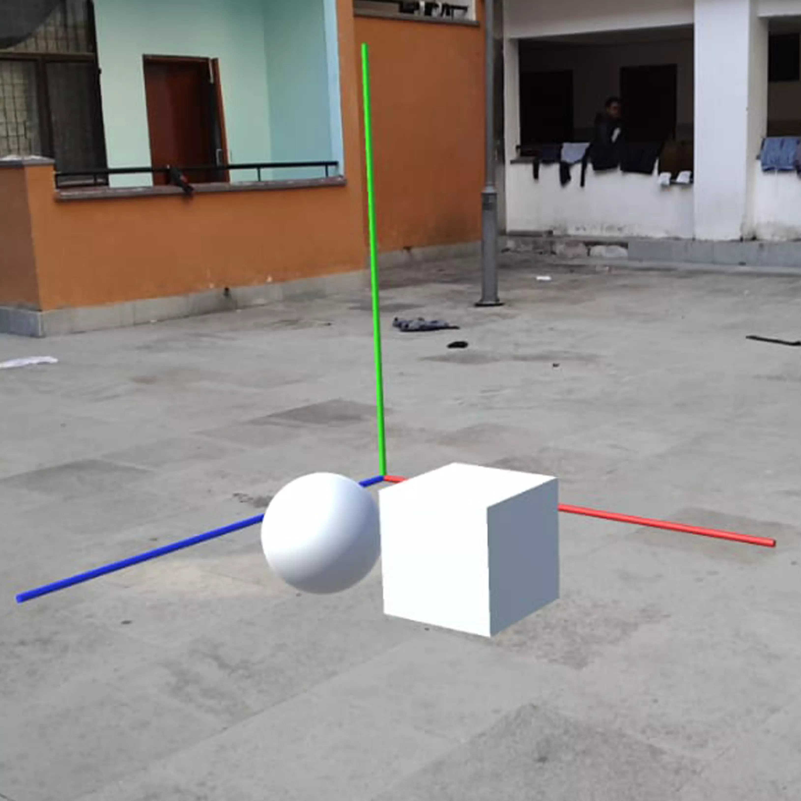

## Description of the Project
* Augmented reality can be used to project virtual objects on target images. This can be used to
make a 3-D visualizer which can show various 3-D curves generated through their equations, example –
equations of conic sections.
The project will work as follows A student can enter conic equations of their choice to see the real-time
generated 3-D models. This will make it easier to understand 3-D curves and conic sections.

## Learning Outcomes: -
*	We will understand the working of AR and applications of this technology in real life. This will be made
using the Unity engine and C# scripting

## Social Benefits:-
*	The students will be able to get a better understanding of mathematical curves and conic
sections.

## Materials we used

|   **Item**        | **Quantity**                                                          |
|-------------------------|------------------------------------------------------------------------|
| Google Cardboard                   | 1                                                          |
    
    
## Images 

    

