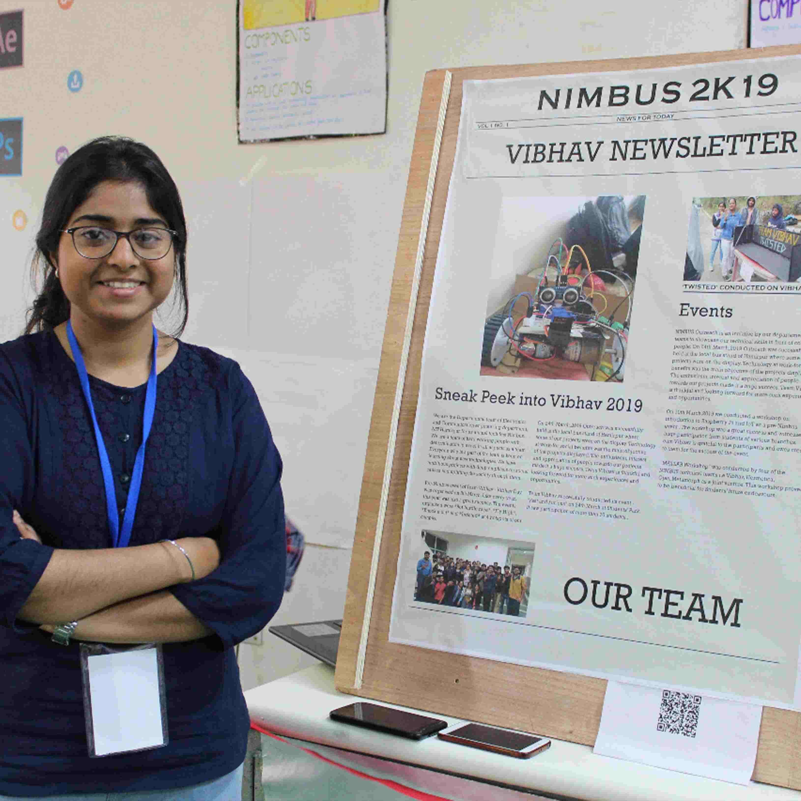

## Description of the Project
* Augmented reality or AR is the process in which a digital image is superimposed on a scene from the real world, creating a view that is partially real and partially virtual reality. This is the field where we virtually come in contact with our reality. The motive behind building this project is to showcase the technology of the future, where we can touch the virtual world behind our lenses. The project will lead you to a tour even in the absence of a real environment where we will be able to interact with the surroundings. We will present each and every project done by us in this environment for the general public along with our manual instructors.

## Learning Outcomes: -
* We showcased the field that  no one has ever tried to touch in our college. Using Unity3D development software we developed the virtual environment through which we can directly interact. We also learned the fascinating field of connecting the world behind our phones to the outside world using apps like Vuforia ,catchoom CraftAR AR SDK is an iOS and Android SDK that renders Augmented Reality experiences with plugins for Cordova and Unity.

## Social Benefits:-
* It can Reduce the manual workforce to create objects in reality to interact with, instead virtualise them to show and connect with them inside our gadgets.
* We can simulate objects and work with them instead of actually creating them just to see their feasibility.

## Materials we used

|   **Item**        | **Quantity**                                                          |
|-------------------------|------------------------------------------------------------------------|
| Webcam                   | 1                                                          |
| RaspberryPi(Model : pi Zero)                   | 1                                                          |

    
    
## Images 

    

