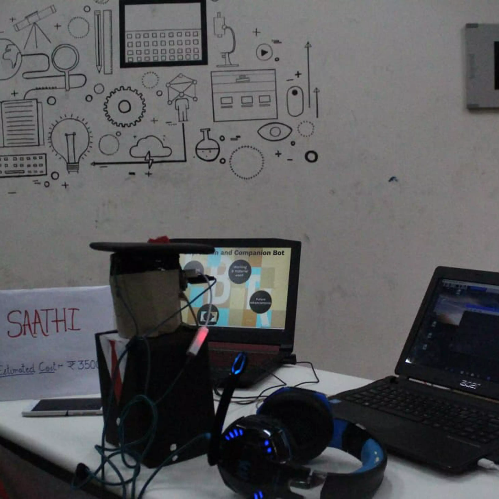

## Description of the Project
* The life of people working in the corporate sector and students who are studying in cities far from home is quite lonely. Depression is a real problem out there and costs thousands of human lives per year. The main motive behind to build this bot is to cure that problem and help people to live a peaceful life. The bot will be established or will be set up on the work desk/Study table so that it can continuously monitor the facial expression of the person sitting on the desk with help of OpenCV and will analyze it with help of Google Cloud services over a period of time to determine whether the person is depressed or angry. The bot also reminds the person sitting on the desk to smile, talk to family, or will help cure their depression using happy quotes. In case the person doesn’t follow advice then the bot will send the condition to guardian or HR in case of student or office employees respectively,  etc. Also, this bot can act as a companion by answering any query generated by the user.

## Learning Outcomes: -
* We learned to implement Python libraries like OpenCV, Tensor Flow, Pillow, etc.
* We learned to use Google cloud vision
* We learned to Use Raspberry Pi on a much-advanced scale

## Social Benefits:-
* This can save valuable human lives which are lost every year due to depression
* This can provide a companion bot to people who are living alone

## Materials we used

|   **Item**        | **Quantity**                                                          |
|-------------------------|------------------------------------------------------------------------|
| Raspberry Pi 3 Model B                   | 1                                                          |
| Robodo Electronics SG 90 Tower Pro Micro Servo Motor  | 1                                                          |
| mini USB microphone                   | 1                                                          |

    
    
## Images 

    

