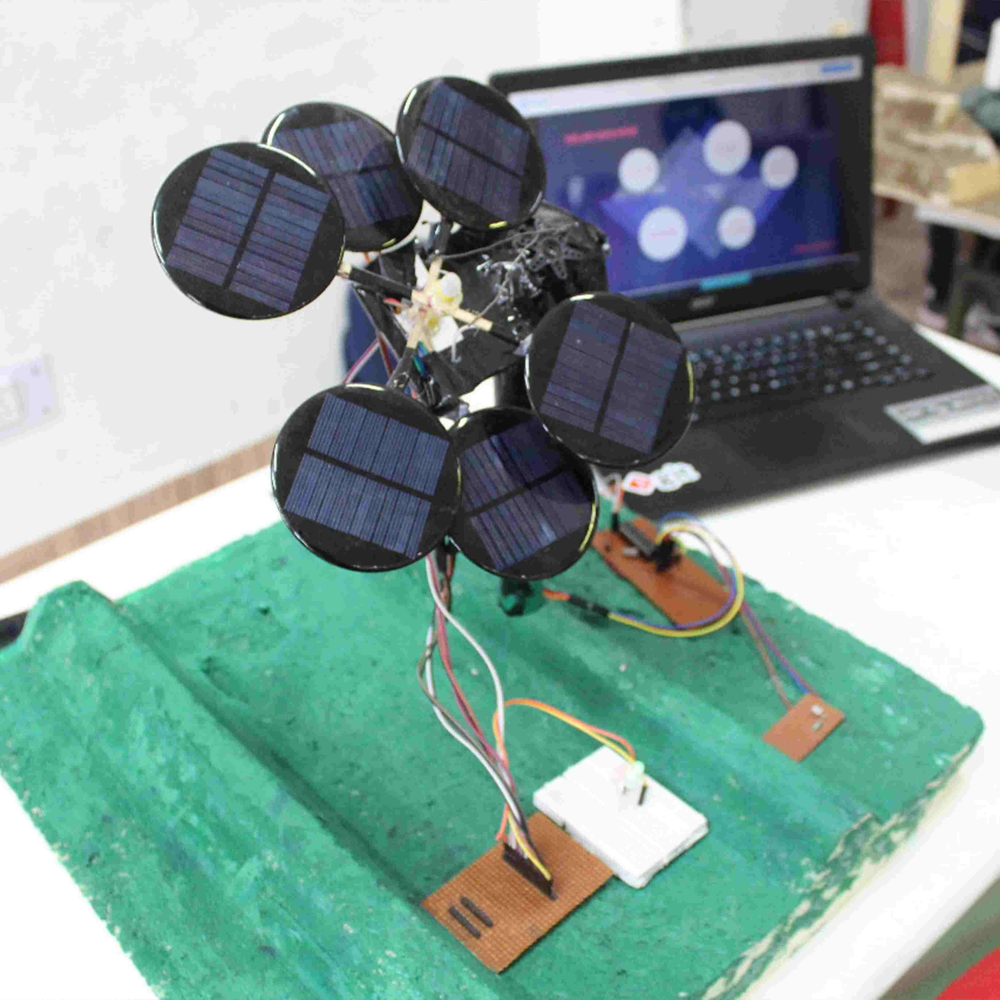

## Description of the Project
* This is a mini portable solar power plant that is based on a sunflower model. This is a model which receives maximum sunlight and it saves a lot of space as compared to other solar plants.

## Learning Outcomes: -
* How to use LDR Sensor
* How to work with servo motors

## Material's we used

|   **Item**        | **Quantity**                                                          |
|-------------------------|------------------------------------------------------------------------|
| Servo Motors                  | 4                                                          |
| Arduino Uno                   | 1                                                          |
| Motor Driver(L298)                   | 1                                                          |

    
    
## Images 

    

