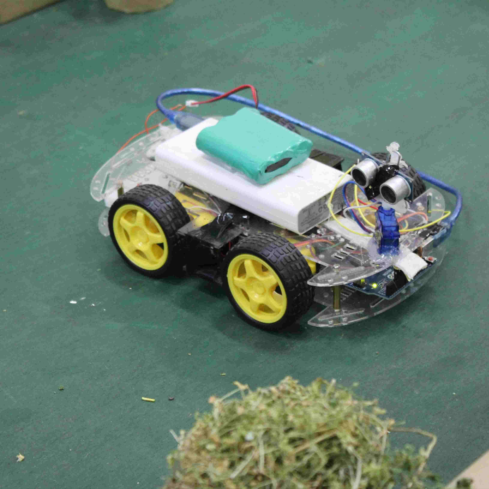

## Description of the Project
* The proposed solution will monitor plant growth and suggest improvements to increase the green cover. Traditionally, humans have to manually audit large farms using their smartphones to check the crops, in most advanced cases. This takes a lot of time and effort. A uniform robotic platform going around the farm can solve these issues and create the marking a lot quicker. The speed may create it easier to share the platform between multiple farms. Combining the power of image processing with autonomous navigation can build a powerful bot that can move in farms to help the farming. We also converted it into a fully convolutional neural network to make it faster and more efficient. The growth of the plants would be monitored using machine learning. The total training dataset consist of approximately 2000 images of different plant diseases which will be detected in the plant using camera.

## Challenges: -
*	Keeping the size/weight of the robot small enough that it doesn't damage the crops itself.
*	Navigating without damaging existing crops.
*	Finding a way to safely mark diseased crops.
*   Finding a dataset and farm to possibly test the platform

## Learning Outcomes: -
* To make bot fully autonomous we will use Convolution Neural Networking
model.
* Image Processing will be used to detect gradual growth, or any anomaly in the plant.
* IOT will be used to provide authorities with any alert regarding the health of the plant.
* Mechatronics will be used to make a powerful bot that can move on any terrain.
* Basic mechanics will be used to mount marking mechanism on the bot to mark the diseased plants.

## Social Benefits:-
*	Will help farmers in maintenance of the crop remotely.
*	Precise detection of crop disease such that particular solution may be applied to selected plant.
*	Will reduce human labour

## Materials we used

|   **Item**        | **Quantity**                                                          |
|-------------------------|------------------------------------------------------------------------|
| Webcam                   | 1                                                          |
| Raspberry Pi 3B+                    | 1                                                          |
| Arduino Uno                   | 1                                                          |
| Motor Driver(L298)                   | 1                                                          |
| Robotbanao BO1 Duel shaft BO motor 150 rpm with wheel   | 1                                                          |

    
    
## Images 

    

